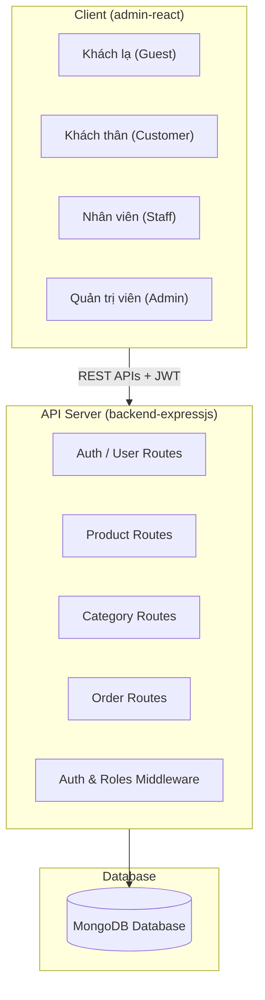
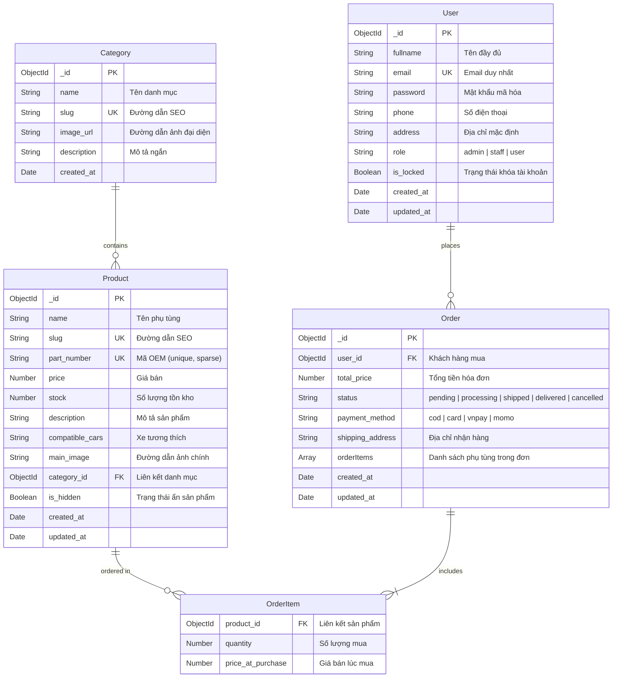

# Tài Liệu Đặc Tả & Thiết Kế Hệ Thống AutoParts

Tài liệu này cung cấp cái nhìn toàn cảnh về thiết kế kiến trúc hệ thống, định nghĩa các tác nhân (Actors), phân loại chi tiết các ca sử dụng (Use Cases) và các luồng nghiệp vụ cốt lõi của dự án AutoParts E-commerce & Admin Panel.

---

## 1. Kiến Trúc Tổng Quan Hệ Thống

Hệ thống được thiết kế theo mô hình Client-Server phân tách:
- **Frontend (admin-react):** Được xây dựng bằng ReactJS, Vite và Tailwind CSS v4. Đảm nhận cả giao diện mua sắm phía khách hàng (Shop) và trang quản trị (Admin Panel).
- **Backend (backend-expressjs):** Được xây dựng bằng Node.js, ExpressJS và Mongoose. Cung cấp hệ thống RESTful API kết nối đến cơ sở dữ liệu MongoDB.
- **Database (MongoDB):** Lưu trữ dữ liệu về người dùng, danh mục, sản phẩm, và đơn đặt hàng.



---

## 2. Mô Tả Tác Nhân (Actor Descriptions)

Hệ thống quản lý phân quyền chặt chẽ dựa trên 4 nhóm tác nhân sau:

| Tác nhân | Ký hiệu (Role DB) | Mô tả |
| :--- | :--- | :--- |
| **Khách lạ** | *Guest / Unauthenticated* | Người dùng vãng lai truy cập website. Có thể tìm kiếm, duyệt sản phẩm và đăng ký tài khoản. |
| **Khách thân** | `user` | Khách hàng đã đăng ký và đăng nhập. Có quyền mua sắm cá nhân, xem và hủy đơn hàng của chính mình. |
| **Nhân viên** | `staff` | Nhân sự vận hành cửa hàng. Có quyền xử lý đơn hàng, thêm/sửa sản phẩm, ẩn sản phẩm khỏi Shop nhưng không thể xóa dữ liệu vĩnh viễn. |
| **Admin** | `admin` | Quản trị viên tối cao. Toàn quyền quản lý dữ liệu, xóa cứng thông tin, quản lý tài khoản nhân sự và theo dõi báo cáo tài chính cấp cao. |

---

## 3. Đặc Tả Chi Tiết Ca Sử Dụng (Use Case Specification)

### 3.1. Sơ đồ Use Case tổng quát
```mermaid
leftToRightDirection
actor "Khách lạ" as Guest
actor "Khách thân" as Customer
actor "Nhân viên" as Staff
actor "Quản trị viên" as Admin

Customer --> Guest : Kế thừa quyền
Admin --> Staff : Kế thừa quyền

rectangle "Hệ Thống Mua Sắm (Shop)" {
  usecase "Xem & tìm kiếm phụ tùng" as UC_View
  usecase "Đăng ký & Đăng nhập" as UC_Auth
  usecase "Quản lý giỏ hàng tạm" as UC_Cart
  usecase "Đặt hàng & Thanh toán" as UC_Checkout
  usecase "Xem lịch sử mua hàng" as UC_History
  usecase "Hủy đơn hàng chờ duyệt" as UC_CancelOrder
}

rectangle "Hệ Thống Quản Trị (Admin Panel)" {
  usecase "Duyệt & Cập nhật đơn hàng" as UC_ManageOrders
  usecase "Thêm / Sửa sản phẩm & danh mục" as UC_ManageCatalog
  usecase "Ẩn / Hiện sản phẩm khỏi Shop" as UC_HideProduct
  usecase "Quản lý nhân viên & Khóa tài khoản" as UC_ManageUsers
  usecase "Xem biểu đồ & Báo cáo doanh thu" as UC_Reports
  usecase "Xóa cứng dữ liệu vĩnh viễn" as UC_DeleteData
}

Guest --> UC_View
Guest --> UC_Auth
Guest --> UC_Cart

Customer --> UC_Checkout
Customer --> UC_History
Customer --> UC_CancelOrder

Staff --> UC_ManageOrders
Staff --> UC_ManageCatalog
Staff --> UC_HideProduct

Admin --> UC_ManageUsers
Admin --> UC_Reports
Admin --> UC_DeleteData
```

### 3.2. Bảng Đặc Tả Chi Tiết Các Use Case

#### Nhóm 1: Khách lạ & Khách thân (Hệ thống Shop)
- **UC_01: Đăng ký & Đăng nhập:** Cho phép người dùng tạo tài khoản mới và đăng nhập. Hệ thống tách biệt hoàn toàn giữa trang đăng ký dành cho Khách hàng (`/register` - đăng ký vai trò `user`) và trang đăng ký dành cho Quản trị viên (`/admin/register` - đăng ký vai trò `admin`). Sau khi đăng nhập, hệ thống ghi nhớ token và điều hướng về trang tương ứng với vai trò.
- **UC_02: Tìm kiếm & Lọc sản phẩm:** Khách hàng tìm kiếm phụ tùng bằng tên hoặc mã OEM, lọc theo danh mục hoặc khoảng giá để tìm kiếm nhanh chóng.
- **UC_03: Đặt hàng & Thanh toán:** Khách thân nhập thông tin giao hàng, kiểm tra giỏ hàng và tạo đơn hàng mới. Hệ thống sẽ tự động trừ số lượng sản phẩm tương ứng trong kho.
- **UC_04: Xem lịch sử & Hủy đơn:** Khách thân theo dõi trạng thái đơn hàng (Chờ xác nhận, Đang giao, Đã giao, Đã hủy). Khách thân được phép hủy đơn hàng nếu đơn hàng đang ở trạng thái Chờ xác nhận (`pending`). Khi hủy thành công, số lượng tồn kho sản phẩm sẽ được tự động hoàn lại database.

#### Nhóm 2: Nhân viên & Admin (Hệ thống Admin Panel)
- **UC_05: Quản lý & Duyệt đơn hàng:** Nhân viên/Admin xem danh sách tất cả các đơn hàng, kiểm tra chi tiết sản phẩm cần đóng gói và chuyển trạng thái đơn (từ Chờ xác nhận sang Đang giao, Đã giao, hoặc Hủy).
- **UC_06: Quản lý danh mục & sản phẩm:** Nhân viên/Admin thêm mới hoặc chỉnh sửa thông tin sản phẩm và danh mục phụ tùng.
- **UC_07: Ẩn/Hiện sản phẩm:** Nhân viên/Admin có thể bật/tắt trạng thái ẩn của sản phẩm. Khi sản phẩm bị ẩn (`is_hidden: true`), hệ thống Shop sẽ tự động lọc bỏ sản phẩm này, khách hàng không thể tìm kiếm hay mua được nữa.
- **UC_08: Quản lý người dùng & nhân sự (Admin only):** Admin xem danh sách tất cả tài khoản, tạo mới tài khoản cấp cho nhân viên vận hành (`staff` hoặc `admin`), và thực hiện khóa/mở khóa các tài khoản vi phạm hoặc nhân viên đã nghỉ việc.
- **UC_09: Thống kê & Báo cáo doanh thu (Admin only):** Admin theo dõi biểu đồ cột doanh thu 6 tháng gần nhất, danh sách sản phẩm bán chạy nhất và biểu đồ phân bổ số lượng nhân sự/người dùng.
- **UC_10: Xóa cứng dữ liệu (Admin only):** Admin có quyền xóa vĩnh viễn sản phẩm, danh mục hoặc đơn hàng ra khỏi cơ sở dữ liệu. Nhân viên (`staff`) không có quyền này và các nút Xóa sẽ bị ẩn hoàn toàn trên giao diện.

---

## 4. Các Luồng Nghiệp Vụ Cốt Lõi

### Luồng 1: Đặt hàng & Giảm tồn kho
1. Khách thân chọn sản phẩm và tiến hành Checkout.
2. Backend kiểm tra tồn kho của từng sản phẩm trong đơn hàng.
3. Nếu sản phẩm nào không đủ tồn kho, trả về lỗi và dừng giao dịch.
4. Nếu đủ tồn kho, backend thực hiện trừ tồn kho (`stock = stock - quantity`).
5. Tạo bản ghi đơn hàng mới với trạng thái `pending` và trả về kết quả thành công cho Client.

### Luồng 2: Hủy đơn hàng & Hoàn tồn kho
1. Khách thân yêu cầu hủy đơn hàng (hoặc Admin hủy đơn).
2. Backend kiểm tra trạng thái đơn hàng. Nếu đơn hàng không phải là `pending`, từ chối hủy.
3. Backend duyệt qua danh sách sản phẩm trong đơn hàng, hoàn trả số lượng tương ứng vào kho (`stock = stock + quantity`).
4. Cập nhật trạng thái đơn hàng thành `cancelled`.

---

## 5. Thiết Kế Cơ Sở Dữ Liệu (Database Design)

Hệ thống sử dụng cơ sở dữ liệu MongoDB thông qua thư viện ODM Mongoose. Cơ sở dữ liệu bao gồm 4 collection chính được tổ chức với cấu trúc chi tiết dưới đây.

### 5.1. Sơ đồ Quan hệ Thực thể (Entity-Relationship Diagram)

Dưới đây là sơ đồ ER biểu diễn mối quan hệ giữa các collection trong hệ thống AutoParts:



---

### 5.2. Chi Tiết Các Collection & Schemas

#### 1. Collection `users` (Mongoose Model: `User`)
Lưu trữ thông tin người dùng bao gồm Khách thân (`user`), Nhân viên (`staff`) và Quản trị viên (`admin`).

| Trường | Kiểu dữ liệu | Ràng buộc / Validation | Mô tả |
| :--- | :--- | :--- | :--- |
| `_id` | `ObjectId` | Auto-generated PK | Khóa chính của bản ghi |
| `fullname` | `String` | `required: true`, `maxLength: 100` | Họ và tên đầy đủ |
| `email` | `String` | `required: true`, `unique: true`, Regex (`/.+\@.+\..+/`), `maxLength: 100` | Địa chỉ email đăng nhập |
| `password` | `String` | `required: true`, `maxLength: 255` | Mật khẩu (được mã hóa) |
| `phone` | `String` | `maxLength: 20` | Số điện thoại liên lạc |
| `address` | `String` | Optional | Địa chỉ mặc định của người dùng |
| `role` | `String` | `enum: ['admin', 'staff', 'user']`, `default: 'user'` | Vai trò truy cập trong hệ thống |
| `is_locked` | `Boolean` | `default: false` | `true` nếu tài khoản bị Admin khóa |
| `created_at` | `Date` | Tự động sinh | Thời điểm tạo tài khoản |
| `updated_at` | `Date` | Tự động sinh | Thời điểm cập nhật tài khoản gần nhất |

#### 2. Collection `categories` (Mongoose Model: `Category`)
Lưu trữ thông tin về các phân loại, nhóm sản phẩm (ví dụ: Động cơ, Gầm máy, Điện - Điều hòa, lọc dầu...).

| Trường | Kiểu dữ liệu | Ràng buộc / Validation | Mô tả |
| :--- | :--- | :--- | :--- |
| `_id` | `ObjectId` | Auto-generated PK | Khóa chính danh mục |
| `name` | `String` | `required: true`, `maxLength: 100` | Tên danh mục |
| `slug` | `String` | `required: true`, `unique: true`, `maxLength: 100` | Chuỗi tối ưu URL cho danh mục |
| `image_url` | `String` | `maxLength: 255` | Ảnh đại diện của danh mục |
| `description` | `String` | Optional | Mô tả chi tiết về danh mục |
| `created_at` | `Date` | Tự động sinh | Thời điểm tạo danh mục (Không dùng `updated_at`) |

#### 3. Collection `products` (Mongoose Model: `Product`)
Lưu trữ các thông tin chi tiết của từng phụ tùng, linh kiện ô tô.

| Trường | Kiểu dữ liệu | Ràng buộc / Validation | Mô tả |
| :--- | :--- | :--- | :--- |
| `_id` | `ObjectId` | Auto-generated PK | Khóa chính sản phẩm |
| `name` | `String` | `required: true`, `maxLength: 255` | Tên phụ tùng |
| `slug` | `String` | `required: true`, `unique: true`, `maxLength: 255` | Chuỗi tối ưu URL cho sản phẩm |
| `part_number` | `String` | `unique: true`, `sparse: true`, `maxLength: 100` | Mã OEM tra cứu phụ tùng |
| `price` | `Number` | `required: true` | Đơn giá sản phẩm |
| `stock` | `Number` | `default: 0` | Số lượng hàng tồn kho |
| `description` | `String` | Optional | Mô tả thông số kỹ thuật |
| `compatible_cars` | `String` | Optional | Dòng xe tương thích (Toyota, Mazda...) |
| `main_image` | `String` | `maxLength: 255` | Đường dẫn ảnh chính của sản phẩm |
| `category_id` | `ObjectId` | `ref: 'Category'`, `required: true` | Liên kết đến danh mục sản phẩm |
| `is_hidden` | `Boolean` | `default: false` | `true` để ẩn khỏi giao diện mua sắm |
| `created_at` | `Date` | Tự động sinh | Thời điểm đăng sản phẩm |
| `updated_at` | `Date` | Tự động sinh | Thời điểm cập nhật sản phẩm |

#### 4. Collection `orders` (Mongoose Model: `Order`)
Lưu trữ thông tin hóa đơn mua phụ tùng, bao gồm thông tin thanh toán, giao hàng và danh sách sản phẩm.

| Trường | Kiểu dữ liệu | Ràng buộc / Validation | Mô tả |
| :--- | :--- | :--- | :--- |
| `_id` | `ObjectId` | Auto-generated PK | Khóa chính đơn hàng |
| `user_id` | `ObjectId` | `ref: 'User'`, `required: true` | Liên kết khách hàng đặt mua |
| `total_price` | `Number` | `required: true` | Tổng trị giá đơn hàng |
| `status` | `String` | `enum: ['pending', 'processing', 'shipped', 'delivered', 'cancelled']`, `default: 'pending'` | Trạng thái xử lý của đơn hàng |
| `payment_method` | `String` | `enum: ['cod', 'card', 'vnpay', 'momo']`, `default: 'cod'` | Hình thức thanh toán |
| `shipping_address` | `String` | `required: true` | Địa chỉ chi tiết nhận hàng |
| `orderItems` | `Array` | Mảng chứa sub-schema `orderItemSchema` | Danh sách sản phẩm được mua |
| `created_at` | `Date` | Tự động sinh | Thời điểm đặt hàng |
| `updated_at` | `Date` | Tự động sinh | Thời điểm cập nhật trạng thái đơn hàng |

##### Chi tiết Sub-schema `orderItemSchema` (Tích hợp trong `orderItems` của Đơn hàng)
Đây là cấu trúc của từng mặt hàng nằm trong mảng `orderItems` (sử dụng thuộc tính `{ _id: false }` để tránh tự sinh id phụ):

- **`product_id`** (`ObjectId`, `ref: 'Product'`, `required: true`): Khóa ngoại tham chiếu đến sản phẩm.
- **`quantity`** (`Number`, `required: true`): Số lượng đặt mua cho mặt hàng này.
- **`price_at_purchase`** (`Number`, `required: true`): Đơn giá của sản phẩm tại đúng thời điểm thanh toán để giữ tính toàn vẹn hóa đơn nếu sản phẩm thay đổi giá sau này.

---

### 5.3. Quan Hệ & Toàn Vẹn Dữ Liệu (Relationships & Referential Integrity)

1. **Quan hệ Category -> Product (1 - Nhiều):**
   - Một Danh mục (`Category`) chứa nhiều Sản phẩm (`Product`).
   - Khóa ngoại `category_id` trong `Product` trỏ đến `_id` của `Category`.
   - Ràng buộc: Khi Admin xóa danh mục (chỉ có quyền Admin), hệ thống cần đảm bảo hoặc là không còn sản phẩm nào thuộc danh mục đó hoặc cập nhật các sản phẩm liên quan.

2. **Quan hệ User -> Order (1 - Nhiều):**
   - Một Người dùng (`User`) có thể đặt nhiều Đơn hàng (`Order`).
   - Khóa ngoại `user_id` trong `Order` tham chiếu đến `_id` của `User`.

3. **Quan hệ Product -> OrderItem (1 - Nhiều thông qua Embedded Array):**
   - Mỗi đơn hàng chứa danh sách các `orderItems`. Mỗi phần tử liên kết đến một `Product` thông qua trường `product_id`.
   - **Tính toàn vẹn giá (Price Lock):** Lưu trữ trực tiếp `price_at_purchase` trong `orderItems` thay vì chỉ lưu `product_id` để tránh việc thay đổi giá sản phẩm trên Shop làm sai lệch dữ liệu tài chính của các đơn hàng cũ.
   - **Đồng bộ Tồn kho (Stock Consistency):** Khi đơn hàng được tạo (`pending`), kho của các sản phẩm tương ứng giảm đi `quantity`. Khi đơn hàng bị hủy (`cancelled`) bởi khách hàng hoặc quản trị viên, kho hàng sẽ được cộng hoàn lại giá trị `quantity` tương ứng.

